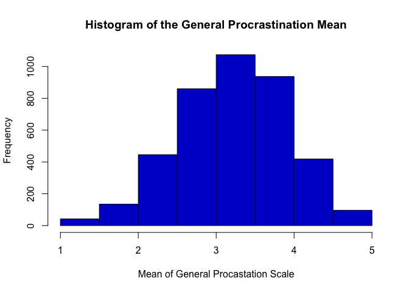
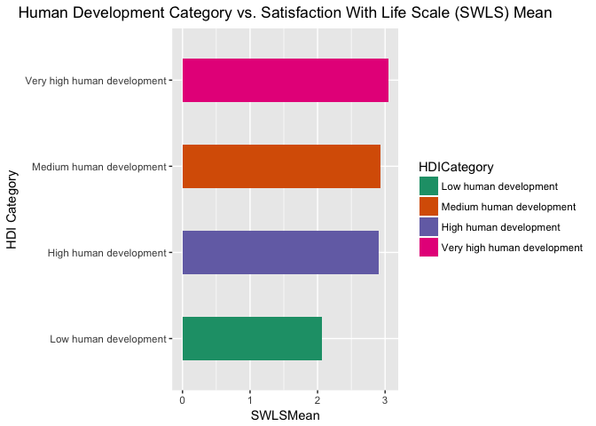

# CaseStudy2
Kevin Dickens & Stephen Merritt  
November 26, 2017  
# Introduction

## Requried Libraries

```r
library(rvest)
library(stringr)
library(ggplot2)
library(knitr)
library(dplyr)
```

```
## Warning: Installed Rcpp (0.12.12) different from Rcpp used to build dplyr (0.12.11).
## Please reinstall dplyr to avoid random crashes or undefined behavior.
```

```r
library(plyr)
```

## Tidying The Qualtrics Data

```r
#Data Ingest and initialization
rawdata<-read.csv("~/6306DoingDataScience/6306CaseStudy2/Data/Procrastination.csv", header=TRUE)

#2a. Output Rows and Columns
nrow(rawdata)
```

```
## [1] 4264
```

```r
ncol(rawdata)
```

```
## [1] 61
```

```r
#Assigning to new variable.  This is done to make it easier to go back to clean data without importing again.
tidydata<-rawdata

#2b.  Renaming columns with meaningful and compressed names.  See codebook for more details.
colnames(tidydata)<-c("Age", "Gender", "Kids", "Education", "WorkStatus", "AnnIncome", "Occupation","TenureY",
                     "TenureM", "CommSize", "Country", "Marital", "Sons", "Daughters", "DP1", "DP2", "DP3", "DP4", "DP5",
                     "AIP1", "AIP2", "AIP3", "AIP4", "AIP5", "AIP6", "AIP7", "AIP8", "AIP9", "AIP10", "AIP11", "AIP12",
                     "AIP13", "AIP14", "AIP15", "GP1", "GP2", "GP3", "GP4", "GP5", "GP6", "GP7", "GP8", "GP9", "GP10",
                     "GP11", "GP12", "GP13", "GP14", "GP15", "GP16", "GP17", "GP18", "GP19", "GP20", "SWLS1", "SWLS2",
                     "SWLS3", "SWLS4", "SWLS5", "SelfP", "OthersP")

#2d A vector is created with appropriate column names to be made into characters.
char<-c("Gender", "Kids", "Education", "WorkStatus", "Occupation", "CommSize", "Country", "Marital", "Sons", "SelfP", "OthersP")
tidydata[char] <- sapply(tidydata[char], as.character) #All columns in char are converted to character fields.

#2c-i.  Tenure (Years of service) are rounded to the nearest integer and then converted to integers.  Finally the 999 values are converted to NAs.
tidydata$TenureY<-round(tidydata$TenureY)
tidydata$TenureY<-as.integer(tidydata$TenureY)
tidydata$TenureY[tidydata$TenureY ==999] <- NA

#2-c-i Rounding of Age to remove half-years.
tidydata$Age<-floor(tidydata$Age)

#2-c-i Remove "kids" from the Kids Variable response so the end result is a Yes/No answer.
tidydata$Kids<-gsub(" Kids", "", tidydata$Kids, fixed=TRUE)

#2-c-i Fixed several country spellings and syntax to match HDI tables (ex. Isreal to Israel)
tidydata$Country[tidydata$Country == 'Isreal'] <- "Israel"
tidydata$Country[tidydata$Country == 'Antigua'] <- "Antigua & Barbuda"
tidydata$Country[tidydata$Country == 'Columbia'] <- "Colombia"
tidydata$Country[tidydata$Country == 'Macao'] <- "China"
tidydata$Country[tidydata$Country == 'Taiwan'] <- "China"
tidydata$Country[tidydata$Country == 'Guam'] <- "United States"
tidydata$Country[tidydata$Country == 'Puerto Rico'] <- "United States"
tidydata$Country[tidydata$Country == 'Yugoslavia'] <- "Serbia"
tidydata$Country[tidydata$Country == 'Bermuda'] <- "United Kingdom"

#2c-iii.  All entries with Country=0 are replaced with blank (missing) values
tidydata$Country[tidydata$Country == '0'] <- ""

#2c-ii.  Improperly encoded male and female values are encoded into their proper values as per notes.  Finally the field is converted to an integer.
tidydata$Sons[tidydata$Sons == 'Male'] <- 1
tidydata$Sons[tidydata$Sons == 'Female'] <- 2
tidydata$Sons<-as.integer(tidydata$Sons)

#2c-iv.  Cleaning up the Occupation variable
tidydata$Occupation<-trimws(tidydata$Occupation, which=c("left")) #Trim the White space that appears in front of some values.
tidydata$Occupation <- gsub("(?<=^| )([a-z])", "\\U\\1", tolower(tidydata$Occupation), perl = T) # Converts all entries to lower space and then capitalizes the first letter of each word.

#All nonsense values that are replaced to indicate no response
tidydata$Occupation[tidydata$Occupation == '0'] <- ""
tidydata$Occupation[tidydata$Occupation == 'Please Specify'] <- ""
tidydata$Occupation[tidydata$Occupation == 'Na'] <- ""
tidydata$Occupation[tidydata$Occupation == 'Ouh'] <- ""
tidydata$Occupation[tidydata$Occupation == 'Fdsdf'] <- ""
tidydata$Occupation[tidydata$Occupation == 'Abc'] <- ""
tidydata$Occupation[tidydata$Occupation == 'S'] <- ""

#Cleaned up the occupation variable to merge several values together, cleanup spelling issues, foreign language responses, abbreviations, etc.
tidydata$Occupation[grepl("Teacher", tidydata$Occupation, ignore.case=FALSE)] <- "Educator"
tidydata$Occupation[grepl("Educator", tidydata$Occupation, ignore.case=FALSE)] <- "Educator"
tidydata$Occupation[grepl("Professor", tidydata$Occupation, ignore.case=FALSE)] <- "Educator"
tidydata$Occupation[grepl("Faculty", tidydata$Occupation, ignore.case=FALSE)] <- "Educator"
tidydata$Occupation[grepl("Profucer", tidydata$Occupation, ignore.case=FALSE)] <- "Educator"
tidydata$Occupation[grepl("Education Specialist", tidydata$Occupation, ignore.case=FALSE)] <- "Educator"
tidydata$Occupation[grepl("Assistant", tidydata$Occupation, ignore.case=FALSE)] <- "Assistant"
tidydata$Occupation[grepl("Asst", tidydata$Occupation, ignore.case=FALSE)] <- "Assistant"
tidydata$Occupation[grepl("Student", tidydata$Occupation, ignore.case=FALSE)] <- "Student"
tidydata$Occupation[grepl("Doctoral", tidydata$Occupation, ignore.case=FALSE)] <- "Student"
tidydata$Occupation[grepl("Postdoc", tidydata$Occupation, ignore.case=FALSE)] <- "Student"
tidydata$Occupation[grepl("Studey", tidydata$Occupation, ignore.case=FALSE)] <- "Student"
tidydata$Occupation[grepl("School", tidydata$Occupation, ignore.case=FALSE)] <- "Student"
tidydata$Occupation[grepl("Nurse", tidydata$Occupation, ignore.case=FALSE)] <- "Nurse"
tidydata$Occupation[grepl("Rn", tidydata$Occupation, ignore.case=FALSE)] <- "Nurse"
tidydata$Occupation[grepl("Lpn", tidydata$Occupation, ignore.case=FALSE)] <- "Nurse"
tidydata$Occupation[grepl("Crna", tidydata$Occupation, ignore.case=FALSE)] <- "Nurse"
tidydata$Occupation[grepl("Programmer", tidydata$Occupation, ignore.case=FALSE)] <- "Programmer"
tidydata$Occupation[grepl("Developer", tidydata$Occupation, ignore.case=FALSE)] <- "Programmer"
tidydata$Occupation[grepl("Engineer", tidydata$Occupation, ignore.case=FALSE)] <- "Engineer"
tidydata$Occupation[grepl("Consultant", tidydata$Occupation, ignore.case=FALSE)] <- "Consultant"
tidydata$Occupation[grepl("Businesswoman", tidydata$Occupation, ignore.case=FALSE)] <- "Business"
tidydata$Occupation[grepl("Sales", tidydata$Occupation, ignore.case=FALSE)] <- "Sales"
tidydata$Occupation[grepl("Mktg", tidydata$Occupation, ignore.case=FALSE)] <- "Marketing"
tidydata$Occupation[grepl("Supervisor", tidydata$Occupation, ignore.case=FALSE)] <- "Supervisor"
tidydata$Occupation[grepl("Coordinatore Operativo", tidydata$Occupation, ignore.case=FALSE)] <- "Operational Coordinator"
tidydata$Occupation[grepl("Md", tidydata$Occupation, ignore.case=FALSE)] <- "Doctor"
tidydata$Occupation[grepl("Vmd", tidydata$Occupation, ignore.case=FALSE)] <- "Veternarian"
tidydata$Occupation[grepl("Psychologis", tidydata$Occupation, ignore.case=FALSE)] <- "Psychologist"
tidydata$Occupation[grepl("Gove Service", tidydata$Occupation, ignore.case=FALSE)] <- "Civil Service"
tidydata$Occupation[grepl("Government", tidydata$Occupation, ignore.case=FALSE)] <- "Civil Service"
tidydata$Occupation[grepl("Vidoe", tidydata$Occupation, ignore.case=FALSE)] <- "Video"
tidydata$Occupation<-gsub("\\It\\b", "IT", tidydata$Occupation)
tidydata$Occupation<-gsub("\\Emt\\b", "EMT", tidydata$Occupation)
tidydata$Occupation<-gsub("\\Ceo\\b", "CEO", tidydata$Occupation)
tidydata$Occupation<-gsub("\\Cad\\b", "CAD", tidydata$Occupation)
tidydata$Occupation<-gsub("\\Pca\\b", "PCA", tidydata$Occupation)

#2e. Generation of the mean DP, AIP, GP, and SWLS indices.  Note that na.rm=TRUE is enabled in case NAs exist.
tidydata$DPMean <- rowMeans(subset(tidydata, select = c(DP1, DP2, DP3, DP4, DP5)), na.rm = TRUE)
tidydata$AIPMean <- rowMeans(subset(tidydata, select = c(AIP1, AIP2, AIP3, AIP4, AIP5, AIP6, AIP7, AIP8, AIP9, AIP10, AIP11, AIP12, AIP13, AIP14, AIP15)), na.rm = TRUE)
tidydata$GPMean <- rowMeans(subset(tidydata, select = c(GP1, GP2, GP3, GP4, GP5, GP6, GP7, GP8, GP9, GP10, GP11, GP12, GP13, GP14, GP15, GP16, GP17, GP18, GP19, GP20)), na.rm = TRUE)
tidydata$SWLSMean <- rowMeans(subset(tidydata, select = c(SWLS1, SWLS2, SWLS3, SWLS4, SWLS5)), na.rm = TRUE)
tidydata$AIPMean<-round(tidydata$AIPMean, digits=0) #Due to math calculations the decimal place of AIP is more than the mean columns of the others.  For consistency it is shortned to match the others.

#3b.  Export tidydata to csv.  Includes HDI.
write.csv(tidydata, "tidydata.csv")

#Diagnostic outputs to generate the number of NA's, summary statistics for the data frame, and verify the structure.
NATidy<-sapply(tidydata, function(y) sum(length(which(is.na(y)))))
#summary(tidydata)
#str(tidydata)
NATidy
```

```
##        Age     Gender       Kids  Education WorkStatus  AnnIncome 
##         71          0          0          0          0        548 
## Occupation    TenureY    TenureM   CommSize    Country    Marital 
##          0        136          6          0          0          0 
##       Sons  Daughters        DP1        DP2        DP3        DP4 
##          4          4          0          0          0          0 
##        DP5       AIP1       AIP2       AIP3       AIP4       AIP5 
##          0          0          0          0          0          0 
##       AIP6       AIP7       AIP8       AIP9      AIP10      AIP11 
##          0          0          0          0          0          0 
##      AIP12      AIP13      AIP14      AIP15        GP1        GP2 
##          0          0          0          0          0          0 
##        GP3        GP4        GP5        GP6        GP7        GP8 
##          0          0          0          0          0          0 
##        GP9       GP10       GP11       GP12       GP13       GP14 
##          0          0          0          0          0          0 
##       GP15       GP16       GP17       GP18       GP19       GP20 
##          0          0          0          0          0          0 
##      SWLS1      SWLS2      SWLS3      SWLS4      SWLS5      SelfP 
##          0          0          0          0          0          0 
##    OthersP     DPMean    AIPMean     GPMean   SWLSMean 
##          0          0          0          0          0
```

## HDI Data Scraping

```r
# 3a scraped Human Development index data from Wikipedia
url <- "https://en.wikipedia.org/wiki/List_of_countries_by_Human_Development_Index#Complete_list_of_countries"
webpage <- read_html(url)
# Determined tables 4 - 14 to contain the Human Development Index data
# Created an empty list, 'tbls' to house the results of the webscrape
tbls <- list()
for (i in c(4,5,7,8,10,11,13,14)){
    tbls[i] <- webpage %>%
        html_nodes("table") %>%
        .[i] %>%
        html_table(fill = TRUE) 
    }
# Used plyr command from dplyr package to convert tbls into a data frame called HDI_df
HDI_df <- (plyr::ldply(tbls))
# Created 'df2' to combine Country/Territory and Country columns of HDI_df
df2 <- data.frame(HDI_df = c(HDI_df[,"Country/Territory"], HDI_df[,"Country"]))
df2 <- sapply(df2, as.character)
# Removed NAs from df2 dataframe
df2 <- setNames(as.data.frame(df2[complete.cases(df2), ]), "Country")
# Removed "Change in rank" info from df2
df2 <- subset(df2, Country != "Change in rank from previous year[1]")
# Removed "Change in rank" info from HDI_df
HDI_df <- HDI_df[-c(1, 28, 54, 83, 112, 133, 155, 177), ]
#HDI_df2 combines HDI_df and df2 via cbind command
HDI_df2 <- cbind(HDI_df, df2)
# Question 3a. Subset unnecessary columns leaving only HDI and Country
HDI_df2 <- HDI_df2[,-c(1, 2, 4)]
# Re-index the columns for better presentation in R
rownames(HDI_df2) <- NULL

# Question 3b Create a new column categorizing the countries
# Convert the HDI column to numeric data
HDI_df2$HDI <- as.numeric(HDI_df2$HDI)
# Create levels via the cut command to mirror the webiste table categories with Swaziland being
# the cutoff for Low Human Development, Moldova being the cutoff for Medium Human Development, 
# Belarus being the cutoff for High Human Development, and Norway being at the very top 
# for very High Human Development
HDI_df2$HDICategory<- cut(HDI_df2$HDI, c(-Inf, 0.549, 0.699, 0.799, Inf))
levels(HDI_df2$HDICategory) <- c("Low human development", "Medium human development", 
                               "High human development", "Very high human development")
write.csv(HDI_df2, "~/6306DoingDataScience/6306CaseStudy2/Data/HumanDevelopmentIndex.csv", row.names = FALSE)
# Israel is mispelled as Isreal in the dataset and needs to be replaced prior to merging

# 3c Merged tidy data of procastiantion.csv to HDI dataframe 
tidydata1 <- merge(HDI_df2, tidydata, by = "Country", all = TRUE)
kable(tidydata1[1:5, c(1:3,9,64:67)], format = "markdown",
      caption = "First Five Rows of Tidy Data")
```


|Country     |   HDI|HDICategory            | AnnIncome| DPMean| AIPMean| GPMean| SWLSMean|
|:-----------|-----:|:----------------------|---------:|------:|-------:|------:|--------:|
|Afghanistan | 0.479|Low human development  |     87500|    3.2|       3|    3.2|      2.4|
|Afghanistan | 0.479|Low human development  |     10000|    3.2|       3|    2.8|      1.4|
|Afghanistan | 0.479|Low human development  |     10000|    3.0|       3|    3.2|      2.8|
|Afghanistan | 0.479|Low human development  |    150000|    3.6|       4|    3.7|      2.4|
|Albania     | 0.764|High human development |     87500|    2.4|       2|    3.0|      3.8|

## Exploratory Data Analysis

```r
# 4a. Based on average retirement ages worldwide, source https://tradingeconomics.com/country-list/retirement-age-men, decided to remove all data
# above the age of 67.5
tidydata18_67 <- subset(tidydata1, Age > 18 & Age < 67.6)

# 4b. Created a function to find the summary stats for Age, Income, HDI, DPMean, GPMean, SWLSMean, and AIPMean.  
funcsummary <- function(x, property){
    med <- median(x[[property]], na.rm = TRUE)
    IQR <- IQR(x[[property]], na.rm = TRUE)
    mn <- mean(x[[property]],  na.rm = TRUE)
    sd <- sd(x[[property]],  na.rm = TRUE)
    min <- min(x[[property]], na.rm = TRUE)
    max <- max(x[[property]], na.rm = TRUE)
    report <- setNames(data.frame(med, IQR, mn, sd, min, max, (max - min)), 
                       c("Median", "IQR", "Mean", "SD", "Min", "Max", "Range"))
    # Digits rounds the output of report to two digits
    kable(report, digits = 3, format = "markdown", 
          caption = paste0("Summary Statisitics for ", property, sep = " "))
   
}
funcsummary(tidydata18_67, "Age")
```


| Median| IQR|   Mean|     SD| Min| Max| Range|
|------:|---:|------:|------:|---:|---:|-----:|
|     37|  17| 37.863| 13.298|  19|  67|    48|

```r
funcsummary(tidydata18_67, "AnnIncome")
```


| Median|   IQR|     Mean|       SD|   Min|    Max|  Range|
|------:|-----:|--------:|--------:|-----:|------:|------:|
|  45000| 72500| 59731.65| 55174.79| 10000| 250000| 240000|

```r
funcsummary(tidydata18_67, "HDI")
```


| Median| IQR|  Mean|    SD|   Min|   Max| Range|
|------:|---:|-----:|-----:|-----:|-----:|-----:|
|   0.92|   0| 0.905| 0.056| 0.479| 0.949|  0.47|

```r
funcsummary(tidydata18_67, "DPMean")
```


| Median| IQR|  Mean|    SD| Min| Max| Range|
|------:|---:|-----:|-----:|---:|---:|-----:|
|      3| 1.4| 3.053| 0.969|   1|   5|     4|

```r
funcsummary(tidydata18_67, "AIPMean")
```


| Median| IQR|  Mean|    SD| Min| Max| Range|
|------:|---:|-----:|-----:|---:|---:|-----:|
|      3|   2| 2.972| 0.854|   1|   5|     4|

```r
funcsummary(tidydata18_67, "GPMean")
```


| Median|  IQR|  Mean|    SD| Min| Max| Range|
|------:|----:|-----:|-----:|---:|---:|-----:|
|   3.25| 0.95| 3.243| 0.688|   1|   5|     4|

```r
funcsummary(tidydata18_67, "SWLSMean")
```


| Median| IQR|  Mean|    SD| Min| Max| Range|
|------:|---:|-----:|-----:|---:|---:|-----:|
|      3| 1.4| 3.043| 0.972|   1|   5|     4|


```r
# 4b (cont.) Created a histogram for both Annual Income and General Procrastination Scale Mean
hist(tidydata18_67$AnnIncome, col = "blue3", main = "Histogram of Annual Income",
     xlab = "Annual Income in USD")
```

<!-- -->

```r
hist(tidydata18_67$GPMean, col = "blue3", main = "Histogram of the General Procrastination Mean",
     xlab = "Mean of General Procastation Scale")
```

<!-- -->

### Histograms
The income histogram is right skewed with the vast majority of the Income being at or below $50,000 per year.  The general procrastination historgram is left skewed with the majority of mean GP scores being 3 or above.


```r
# 4c Created dataframes to provide the frequency of Gender, WorkStatus, and Occupation
tidydata18_67$WorkStatus <- as.factor(tidydata18_67$WorkStatus)
tidydata18_67$Gender <- as.factor(tidydata18_67$Gender)
#tidydata18_67$Country <- as.factor(tidydata18_67$Country)
#str(tidydata18_67$Country)
ws <- as.data.frame(count(tidydata18_67, 'WorkStatus'))
kable(ws, format = "markdown", caption = "Frequency of Work Status Responses")
```


|WorkStatus | freq|
|:----------|----:|
|           |   42|
|full-time  | 2259|
|part-time  |  463|
|retired    |  151|
|student    |  837|
|unemployed |  257|

```r
gen <- as.data.frame(count(tidydata18_67, 'Gender'))
kable(gen, format = "markdown", caption = "Frequency of Gender Responses")
```


|Gender | freq|
|:------|----:|
|       |    6|
|Female | 2295|
|Male   | 1708|

```r
occ <- as.data.frame(count(tidydata18_67, 'Occupation'))
# Labeled all occupations with a count of 1 as "Other"
occ$Occupation[which(occ$freq == 1)] <- "Other"
occ <- as.data.frame(count(occ, 'Occupation'))
```

```
## Using freq as weighting variable
```

```r
kable(occ, format = "markdown", caption = "Frequency of Occupation Responses")
```


|Occupation                              | freq|
|:---------------------------------------|----:|
|                                        | 2644|
|Academic                                |    2|
|Accountant                              |    2|
|Accounting                              |    2|
|Accounting Manager                      |    2|
|Admin Assist                            |    2|
|Administrator                           |   10|
|Analyst                                 |    5|
|Architect                               |    4|
|Art Director                            |    2|
|Artist                                  |    6|
|Assistant                               |   52|
|Associate                               |    2|
|Attorney                                |   49|
|Bank Teller                             |    3|
|Banker                                  |    2|
|Business                                |    2|
|Business Owner                          |    7|
|CEO                                     |    3|
|Chief Of Staff                          |    2|
|Civil Servant                           |    2|
|Civil Service                           |    2|
|Clerk                                   |    5|
|Clutter Clearer,  Video Editor, Caterer |    2|
|Communications                          |    2|
|Consultant                              |   43|
|Consumer Case Coordinator               |    2|
|Copy Writer                             |    2|
|Counselor                               |    2|
|Creative Director                       |    2|
|Customer Service                        |    9|
|Dentist                                 |    2|
|Deputy Director                         |    3|
|Designer                                |    4|
|Diplomat                                |    2|
|Director                                |   10|
|Doctor; Physician                       |   16|
|Driver                                  |    2|
|Editor                                  |   21|
|Educator                                |  157|
|Engineer                                |   47|
|Epidemiologist                          |    2|
|Executive Director                      |    2|
|Finance                                 |    5|
|Financial Advisor                       |   11|
|Financial Analyst                       |    2|
|Geologist                               |    2|
|Graphic Designer                        |   10|
|Home Maker                              |   11|
|Houswife                                |   16|
|Human Resource Manager                  |    3|
|Insurance                               |    2|
|Insurance Agent                         |    4|
|Internship                              |    2|
|IT                                      |    2|
|IT Director                             |    2|
|IT Specialist                           |    2|
|IT Support                              |    2|
|Journalist                              |    6|
|Journalist (freelance)                  |    2|
|Laboratory Technician                   |    2|
|Law Clerk                               |    2|
|Law Enforcement                         |    3|
|Lecturer                                |    2|
|Letter Carrier                          |    2|
|Librarian                               |    9|
|Library Technician                      |    2|
|Manager                                 |   32|
|Market Analyst                          |    5|
|Market Research Analyst                 |    2|
|Marketing                               |   21|
|Marketing Copywriter                    |    2|
|Musician                                |    3|
|Nanny                                   |    5|
|Nurse                                   |   20|
|Operations Manager                      |    4|
|Other                                   |  374|
|Owner                                   |    2|
|Paralegal                               |    2|
|Paraprofessional                        |    2|
|Pastor ; Life Coach  Clergy             |    5|
|Pharmacist                              |    3|
|Policy Analyst                          |    2|
|President                               |    7|
|Press Officer                           |    2|
|Programmer                              |   34|
|Project Manager                         |   10|
|Psychologist                            |    8|
|Psychotherapist                         |    3|
|Receptionist                            |    3|
|Research Associate                      |    4|
|Research Scientist                      |    8|
|Researcher                              |    3|
|Retail                                  |    4|
|Retired                                 |   25|
|Sales                                   |   18|
|Scientist                               |   12|
|Secretary                               |    5|
|Self Employed                           |    3|
|Self-employed Photographer              |    2|
|Server                                  |   10|
|Social Worker                           |    7|
|Software Pro                            |    2|
|Stocker                                 |    2|
|Student                                 |   27|
|Supervisor                              |   10|
|Systems Analyst                         |    2|
|Technical Writer                        |    4|
|Training Coordinator                    |    2|
|Translator                              |    6|
|Tutor                                   |    5|
|Unemployed                              |   18|
|Veterinarian                            |    2|
|Vice-president                          |    2|
|Web Designer                            |    4|
|Writer                                  |   19|
|Writer/editor                           |    2|

```r
# 4d Determined the counts of participants per country
ppc <- setNames(tally(group_by(tidydata18_67, Country), sort = TRUE), c("Country", "Count"))
kable(ppc, format = "markdown", caption = "Frequency of Response per Country")
```


|Country            | Count|
|:------------------|-----:|
|United States      |  2771|
|Canada             |   243|
|United Kingdom     |   179|
|                   |   159|
|Australia          |    99|
|India              |    78|
|Italy              |    60|
|Germany            |    36|
|Brazil             |    20|
|Ireland            |    19|
|Israel             |    19|
|Netherlands        |    18|
|Sweden             |    15|
|China              |    14|
|Norway             |    14|
|France             |    13|
|Japan              |    13|
|Spain              |    13|
|Finland            |    12|
|New Zealand        |    12|
|South Africa       |    12|
|Mexico             |    11|
|Philippines        |    11|
|Switzerland        |    11|
|Greece             |    10|
|Belgium            |     9|
|Denmark            |     9|
|Turkey             |     9|
|Hong Kong          |     7|
|Portugal           |     7|
|Slovenia           |     6|
|Poland             |     5|
|Romania            |     5|
|Chile              |     4|
|Croatia            |     4|
|Malaysia           |     4|
|Singapore          |     4|
|Afghanistan        |     3|
|Algeria            |     3|
|Argentina          |     3|
|Austria            |     3|
|Czech Republic     |     3|
|Ecuador            |     3|
|Uruguay            |     3|
|Albania            |     2|
|Bulgaria           |     2|
|Colombia           |     2|
|Ghana              |     2|
|Iran               |     2|
|Malta              |     2|
|Peru               |     2|
|Saudi Arabia       |     2|
|Serbia             |     2|
|South Korea        |     2|
|Thailand           |     2|
|Ukraine            |     2|
|Venezuela          |     2|
|Andorra            |     1|
|Bahamas            |     1|
|Barbados           |     1|
|Bolivia            |     1|
|Botswana           |     1|
|Cyprus             |     1|
|Dominican Republic |     1|
|Egypt              |     1|
|El Salvador        |     1|
|Guyana             |     1|
|Hungary            |     1|
|Iceland            |     1|
|Jamaica            |     1|
|Kenya              |     1|
|Lithuania          |     1|
|Luxembourg         |     1|
|Macedonia          |     1|
|Morocco            |     1|
|Myanmar            |     1|
|Nicaragua          |     1|
|Pakistan           |     1|
|Panama             |     1|
|Qatar              |     1|
|Russia             |     1|
|Sri Lanka          |     1|
|Vietnam            |     1|
|Antigua & Barbuda  |     1|

```r
# 4e Determine where self assessment of procrastination match others assessment
tidydata18_67$ProsMatch <- mapply(grepl, pattern = tidydata18_67$SelfP, x = tidydata18_67$OthersP)
#tidydata18_67[, ProsMatch := grepl("SelfP", "OthersP"), by = x]
match <- setNames(tally(group_by(tidydata18_67, ProsMatch)), c("Logical", "Count"))
kable(match, format = "markdown", caption = "Number of Self Perception Matches")
```


|Logical | Count|
|:-------|-----:|
|FALSE   |  1181|
|TRUE    |  2828|

### EDA Results
The survey results indicate a bias towards Western Highly Developed nations with almost 80% of the respondents coming from the US, Canada, and the United Kingdom.  Of the people who chose to identify an occupation (there were 2644 non-responses for occupation), "educator"" was the most frequent survey occupation response (157).  The nearest competitor to "educator" as occupation identified themselves as "assistants".  57% of the respondents were women and 70% of respondents perceptions of their own propensity to procrastinate or not porcrastinate matched the perceptions of others.  

## Deeper Analysis and Visualization

```r
#5b Create a barchart for the top 15 nations in average pro
topfifteen <- tidydata18_67[ ,c("Country", "GPMean", "HDI")]
topfifteen <- setNames(aggregate(topfifteen[ ,2:3], list(Country=topfifteen$Country), mean), 
                       c("Country", "GPMean", "HDI"))
topfifteen <- merge(topfifteen, ppc, by = "Country", all = TRUE)
topfifteen <- subset(topfifteen, Count >=5)
topfifteen <- topfifteen[order(-topfifteen$GPMean), ]
topfifteen$HumanDev<- cut(topfifteen$HDI, c(-Inf, 0.549, 0.699, 0.799, Inf))
levels(topfifteen$HumanDev) <- c("Low human development", "Medium human development", 
                                 "High human development", "Very high human development")
topfifteen <- topfifteen[(1:15), ]
theme_update(plot.title = element_text(hjust = 0.5))
ggplot(topfifteen, aes(x = reorder(Country, GPMean), y = GPMean, 
                    fill = HumanDev)) + 
    geom_bar(stat = "identity", width = 0.5) + 
    ggtitle("Top Fifteen Countries for General Procrastination (GP) Mean") +
    labs(x = "Country", y = "GP Mean") +
    coord_flip() +
    scale_fill_brewer(palette = "Dark2")
```

<!-- -->

```r
#6c Table of topfifteen nations for General Procrastiantion Mean
kable(topfifteen, format = "markdown", caption = "Top 15 Countries for General Procrastination (GP) Mean")
```


|   |Country      |   GPMean|   HDI| Count|HumanDev                    |
|:--|:------------|--------:|-----:|-----:|:---------------------------|
|62 |Poland       | 3.790000| 0.855|     5|Very high human development |
|78 |Turkey       | 3.755556| 0.767|     9|High human development      |
|30 |France       | 3.692308| 0.897|    13|Very high human development |
|70 |Slovenia     | 3.666667| 0.890|     6|Very high human development |
|63 |Portugal     | 3.650000| 0.843|     7|Very high human development |
|75 |Sweden       | 3.643333| 0.913|    15|Very high human development |
|31 |Germany      | 3.608333| 0.926|    36|Very high human development |
|55 |New Zealand  | 3.583333| 0.915|    12|Very high human development |
|33 |Greece       | 3.530000| 0.866|    10|Very high human development |
|40 |Ireland      | 3.518421| 0.923|    19|Very high human development |
|15 |Brazil       | 3.495000| 0.754|    20|High human development      |
|71 |South Africa | 3.470833| 0.666|    12|Medium human development    |
|73 |Spain        | 3.469231| 0.884|    13|Very high human development |
|29 |Finland      | 3.450000| 0.895|    12|Very high human development |
|35 |Hong Kong    | 3.442857| 0.917|     7|Very high human development |


```r
#5c Generating Visualization of AIP by HDI
topfifteen <- tidydata18_67[,c("Country", "AIPMean", "HDI")]
topfifteen <- setNames(aggregate(topfifteen[ ,2:3], list(Country=topfifteen$Country), mean), 
                       c("Country", "AIPMean", "HDI"))
topfifteen <- merge(topfifteen, ppc, by = "Country", all = TRUE)
topfifteen <- subset(topfifteen, Count >=5)
topfifteen <- topfifteen[order(-topfifteen$AIPMean), ]
topfifteen$HumanDev<- cut(topfifteen$HDI, c(-Inf, 0.549, 0.699, 0.799, Inf))
levels(topfifteen$HumanDev) <- c("Low human development", "Medium human development", 
                                 "High human development", "Very high human development")
topfifteen <- topfifteen[(1:15), ]
theme_update(plot.title = element_text(hjust = 0.5))
ggplot(topfifteen, aes(x = reorder(Country, AIPMean), y = AIPMean, 
                       fill = HumanDev)) + 
  geom_bar(stat = "identity", width = 0.5) + 
  ggtitle("Top Fifteen Countries for Adult Inventory of Procrastination (AIP) Mean") +
  labs(x = "Country", y = "AIP Mean") +
  coord_flip() +
  scale_fill_brewer(palette = "Dark2")
```

<!-- -->

```r
kable(topfifteen, format = "markdown", caption = "Top 15 Countries for General Procrastination (AIP) Mean")
```


|   |Country     |  AIPMean|   HDI| Count|HumanDev                    |
|:--|:-----------|--------:|-----:|-----:|:---------------------------|
|62 |Poland      | 3.600000| 0.855|     5|Very high human development |
|78 |Turkey      | 3.555556| 0.767|     9|High human development      |
|30 |France      | 3.538461| 0.897|    13|Very high human development |
|55 |New Zealand | 3.500000| 0.915|    12|Very high human development |
|75 |Sweden      | 3.466667| 0.913|    15|Very high human development |
|35 |Hong Kong   | 3.428571| 0.917|     7|Very high human development |
|33 |Greece      | 3.400000| 0.866|    10|Very high human development |
|65 |Romania     | 3.400000| 0.802|     5|Very high human development |
|61 |Philippines | 3.363636| 0.682|    11|Medium human development    |
|29 |Finland     | 3.333333| 0.895|    12|Very high human development |
|31 |Germany     | 3.305556| 0.926|    36|Very high human development |
|57 |Norway      | 3.285714| 0.949|    14|Very high human development |
|54 |Netherlands | 3.277778| 0.924|    18|Very high human development |
|73 |Spain       | 3.230769| 0.884|    13|Very high human development |
|12 |Belgium     | 3.222222| 0.896|     9|Very high human development |

### Top fifteen country results
When initially reviewing the data for GP and AIP, countries with only one respondent frequently appeared in the topfifteen dataframes.  We dediced to set a new threshold of requiring at least five respondents to be considered in the top-15 list.  This caused a drastics change to the topfifteen dataframes for both AIP and GP, with the overall population dropping from 84 countries to 33.  Countries such as Myanmar, Sri Lanka, Qatar, Panama, Nicaragua, etc.... which only had one respondent were replaced with Greece, Romania, Norway, and Spain.  Countries that were removed from the topfifteen data frames that had more than one respondent were Austria, Malaysia, Uruguay, Ecuador and Colombia, which all had three or less respondents.


```r
#5d Answering relationship of Age vs. Income
#Generate Scatterplot
ggplot(na.omit(tidydata18_67), aes(Age, AnnIncome, color = Gender)) + 
  geom_point(shape = 16, size = 5, show.legend = FALSE, alpha = 1) + 
  geom_smooth(method = 'lm', color = "red") + 
  ggtitle("Age vs. Annual Income by Gender") + labs(x = "Age", y = "AnnIncome")
```

<!-- -->

```r
cor(tidydata18_67$AnnIncome, tidydata18_67$Age, method = "pearson", use="na.or.complete")
```

```
## [1] 0.3717334
```

```r
#Generate Linear Model & Display Statistics
AgeIncome<-lm(AnnIncome~Age, data=na.omit(tidydata))

summary(AgeIncome)
```

```
## 
## Call:
## lm(formula = AnnIncome ~ Age, data = na.omit(tidydata))
## 
## Residuals:
##     Min      1Q  Median      3Q     Max 
## -110877  -29102  -14393   10614  223266 
## 
## Coefficients:
##             Estimate Std. Error t value Pr(>|t|)    
## (Intercept)  3198.63    2531.49   1.264    0.206    
## Age          1470.98      62.91  23.382   <2e-16 ***
## ---
## Signif. codes:  0 '***' 0.001 '**' 0.01 '*' 0.05 '.' 0.1 ' ' 1
## 
## Residual standard error: 51370 on 3598 degrees of freedom
## Multiple R-squared:  0.1319,	Adjusted R-squared:  0.1317 
## F-statistic: 546.7 on 1 and 3598 DF,  p-value: < 2.2e-16
```


```r
#5e Determine if there is a relationship between Human Development and Satisfaction With Life
ggplot(tidydata18_67, aes(HDI, SWLSMean, color = HDICategory)) + 
    geom_point(shape = 16, size = 5, show.legend = FALSE, alpha = 1) + 
    geom_smooth(method = 'lm', color = "red") + 
    ggtitle("HDI vs. Satisfaction With Life Scale (SWLS) Mean") + labs(x = "HDI", y = "SWLSMean")
```

```
## Warning: Removed 160 rows containing non-finite values (stat_smooth).
```

```
## Warning: Removed 160 rows containing missing values (geom_point).
```

<!-- -->

```r
cor(tidydata18_67$HDI, tidydata18_67$SWLSMean, method = "pearson", use = "na.or.complete")
```

```
## [1] 0.04184384
```

```r
SWLSHDICat <- tidydata18_67[ ,c("HDICategory", "SWLSMean")]
SWLSHDICat <- setNames(aggregate(SWLSHDICat[ ,2], list(HDICategory=SWLSHDICat$HDICategory), mean), 
                       c("HDICategory", "SWLSMean"))

ggplot(SWLSHDICat, aes(x = reorder(HDICategory, SWLSMean), y = SWLSMean, 
                       fill = HDICategory)) + 
    geom_bar(stat = "identity", width = 0.5) + 
    ggtitle("Human Development Category vs. Satisfaction With Life Scale (SWLS) Mean") +
    labs(x = "HDI Category", y = "SWLSMean") +
    coord_flip() +
    scale_fill_brewer(palette = "Dark2")
```

<!-- -->

### Scatterplot Results 
The scatterplot data showed very little correlation when comparing the Human Development Index with the Satisfaction With Life scale.  The correlation coefficient was a miniscule positive 0.04.  The barchart demonstrates that when grouped by levels of Human Development, on average those liviing in more Highly developed nations do have a slightly higher satisfaction with life.


